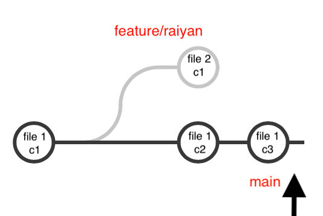
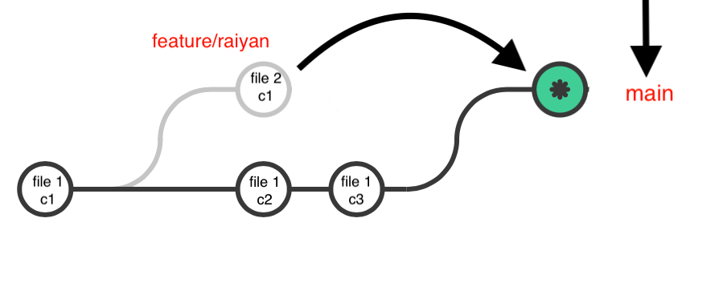

# Steps to rebase

## Create main branch with a commit
1. create repo`git init`
2. Add files for first commit  
- `git add .` 
- `git commit -m "[docs] my first commit initializing repo"`
 

## Create a feature branch with a commit 

1. lets create our branch `git checkout -b "feature/raiyan"`
2. Create a commit on feature branch 
- `git add .`
- `git commit -m "[docs] raiyans feature branch first commit"`

 

## Switching back to main branch to add 2 commits
1. `git checkout main`
2. make and save a change on markdown file
3. `git add .`
4. `git commit -m "[docs] 2nd commit to main"`
5. `git add .`
6. `git commit -m "[docs] 3rd commit to main"`

 

### 1 more commit on feature/raiyan before rebase
1. `git checkout "feature/raiyan"`
2. Create a commit on feature branch 
- `git add .`
- `git commit -m "[docs] raiyans feature branch first commit"`

## Time to rebase
- we want to rebase main with the feature/raiyan changes
1. switch to main `git checkout main`
2. `git rebase main feature/raiyan`

## Resolve conflict
3. you will now be shown a Head or Tail to settle a conflict between 2 commits 

4. make changes and then run `git rebase --continue` to finish the rebase step
5. check your branch and results now

## What if you want to abort?
1. `git rebase --continue`